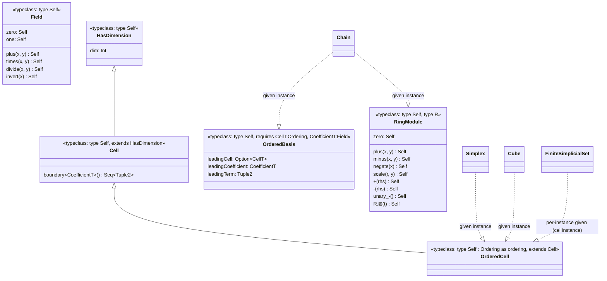
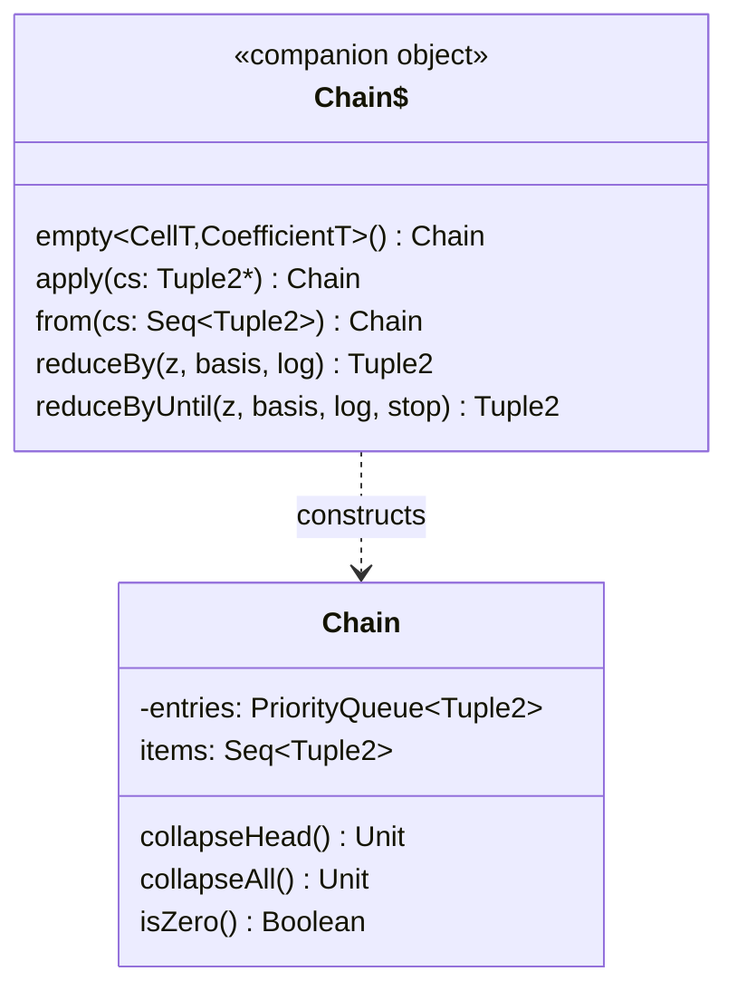
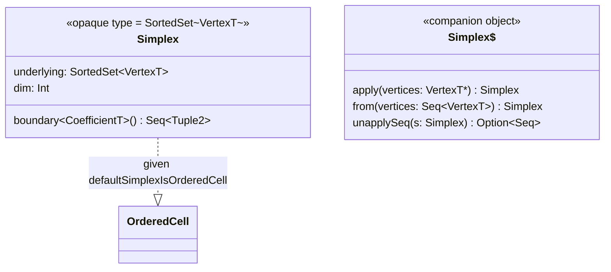
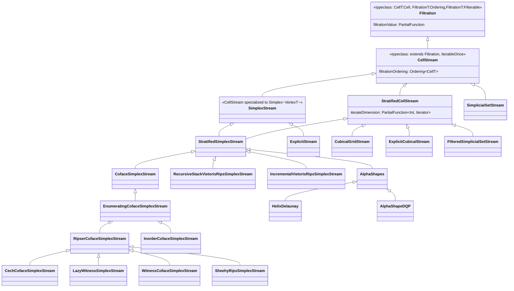
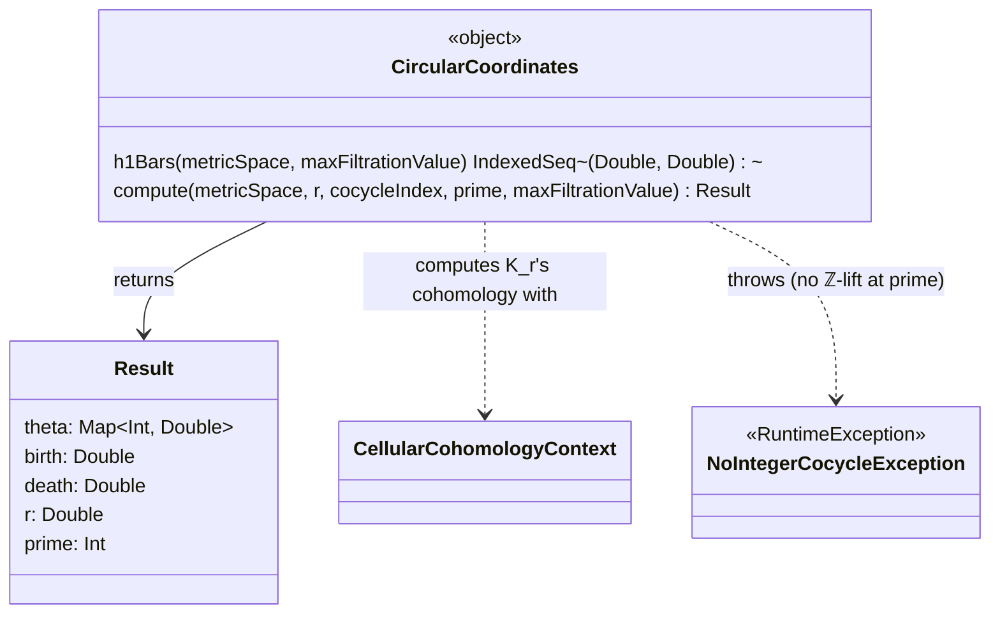
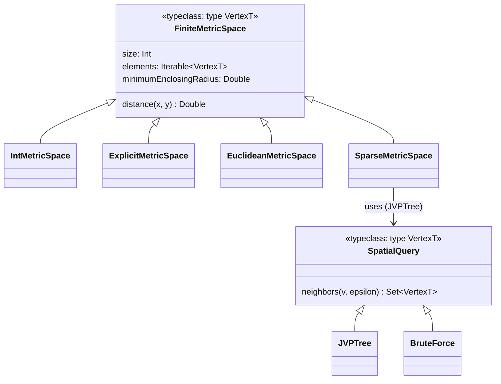
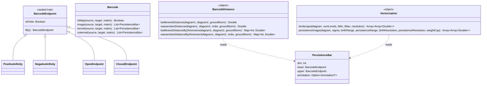

# Mapping the library: class diagrams

@:callout(info)
This page is a structural sketch to help you get oriented, not an exhaustive or automatically generated
reference — field names and signatures can drift out of sync with source over time. When a diagram and the
actual `.scala` file disagree, trust the file.
@:@

## Typeclass hierarchy (`RingModule.scala`, `Field.scala`, `Chain.scala`)

Three concrete `OrderedCell` instances exist: `Simplex[VertexT]`, `Cube`, and a `FiniteSimplicialSet[G]`'s
own generators (that last one is a per-instance `given`, not a global one, since its boundary depends on
that particular simplicial set's own face data). There is no dual `Cocell`/`OrderedCocell` trait pair (an
earlier version had one; removed as the wrong shape for coboundary, which is extrinsic to a cell, not
intrinsic like `boundary`) — `RipserCohomologyContext`/`PackedRipserCohomologyContext` compute coboundaries
directly against `SimplexIndexing` instead (see [Persistence engines](persistence-engines.md)). See the
[Scala 3 primer](scala3-primer.md) for what "typeclass: type Self" and "given instance" mean concretely in
this codebase's syntax.

## `Chain[CellT, CoefficientT]` (`Chain.scala`)

`reduceBy`/`reduceByUntil` are the shared reduction primitives every persistence engine in `Homology.scala`
builds on — see [Architecture](architecture.md) and
[Hard-won invariants #4](gotchas.md).

## `Simplex[VertexT]` (`Simplex.scala`, `SimplexOps.scala`)

`SimplexOps.scala` adds a large `extension` block delegating most of `SortedSet`'s surface (`.size`,
`.map`, `.union`, `.dropIndex`, ...) so `Simplex` "feels like" a set even though it's a zero-cost opaque
wrapper at runtime — see the [primer](scala3-primer.md).

## Streams (`SimplexStream.scala`, `SimplexIndexing.scala`, `VietorisRips.scala`)

These are **alternate stream implementations with a common output contract, not layers on top of one
another** — see [Architecture](architecture.md). `CubicalGridStream`/`ExplicitCubicalStream` produce
`Cube`s rather than `Simplex`es; `SimplicialSetStream`/`FilteredSimplicialSetStream` produce a
`FiniteSimplicialSet[G]`'s own generator type `G`.

## Persistence engines (`homology/Homology.scala`, `homology/PackedRipserCohomology.scala`, `homology/FastCubicalHomology.scala`, `homology/FastAlphaHomology.scala`)

Deliberately *not* diagrammed field-by-field here — their exact state and trust status belongs in one
place. See [Persistence engines](persistence-engines.md) for the full, current picture across
`CellularHomologyContext`/`SimplicialHomologyContext`,
`CellularPersistenceInChunksContext`/`PersistenceInChunksContext`,
`RipserCohomologyContext`, `PackedRipserCohomologyContext`, `CellularCohomologyContext`,
`FastCubicalHomologyContext` (2D cubical grids only), and `FastAlphaHomologyContext` (2D `HelixDelaunay`
alpha complexes only, not yet wired into `matlab`/`cli`).

## Circular coordinates (`homology/CircularCoordinates.scala`)

A standalone construction, not a fifth persistence engine — see [Architecture](architecture.md)'s own
`homology.CircularCoordinates` section for the truncated-complex reframing, the harmonic-smoothing linear
system, and why the output is a per-point angle map rather than a barcode.

## Metric spaces (`FiniteMetricSpace.scala`)

## Barcode representation (`Barcode.scala`, package `org.appliedtopology.tda4j.barcode`)

`AnnotationT` in practice is always `Chain[CellT, CoefficientT]` — the representative cycle/cocycle for a
bar, when an engine tracks one. `BarcodeDistance`/`Vectorization` only ever read a bar's `dim`/`lower`/`upper`
(never `annotation`), and are specialized to `PersistenceBar[Double, _]` rather than sharing `Barcode`'s own
`FiltrationT: Ordering` genericity — see [Architecture](architecture.md)'s "`Barcode.scala`" section
for why, and for `BipartiteMatching.scala`'s two package-private combinatorial primitives
(`HopcroftKarp`/`Hungarian`) `BarcodeDistance` is built on, omitted here as an implementation detail rather
than part of this package's public shape.
