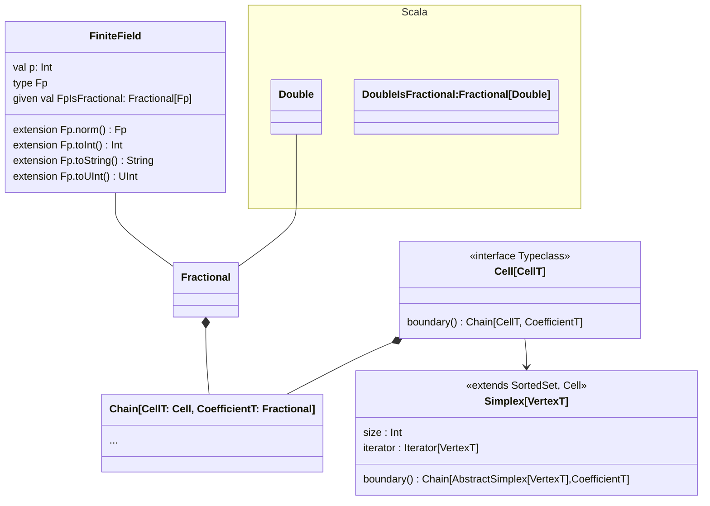
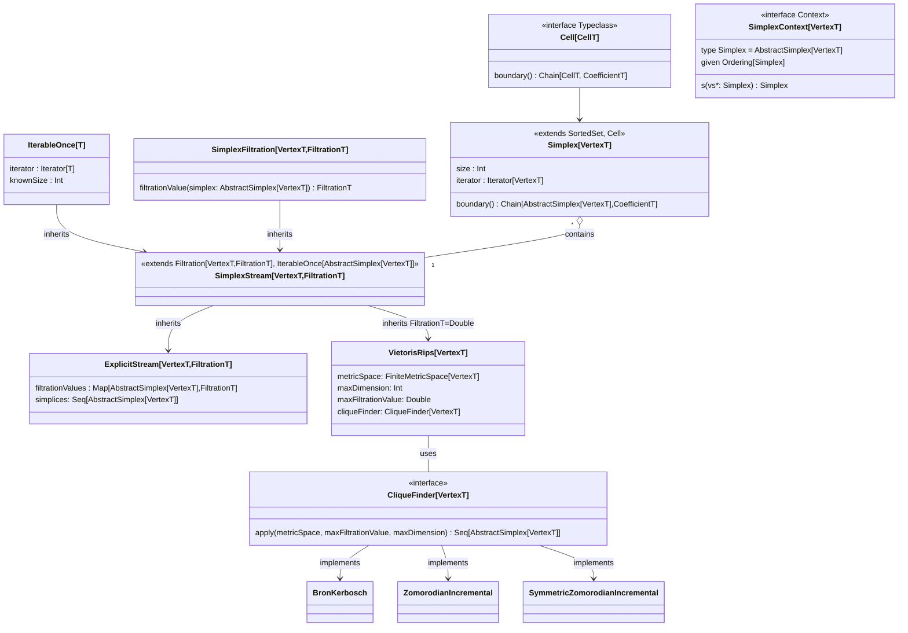

# Mapping the library: class- and type-diagrams

## Support for different coefficients

We handle coefficient types by requiring a `Fractional` instance to be defined, 
which produces all the expected arithmetic operations on coefficients.
`Fractional[Double]` already exists in Scala, and we also implement in the same
way as is main-stream in the persistent homology library ecosystem finite field
arithmetic with lookup tables for inverses.

## How do we describe a Simplicial Complex?

