# Mapping the library: class- and type-diagrams

## Support for different coefficients

We handle coefficient types by requiring a `Fractional` instance to be defined, 
which produces all the expected arithmetic operations on coefficients.
`Fractional[Double]` already exists in Scala, and we also implement in the same
way as is main-stream in the persistent homology library ecosystem finite field
arithmetic with lookup tables for inverses.

```
classDiagram
    class FiniteField {
        val p: Int
        type Fp
        given val FpIsFractional: Fractional[Fp]
        extension Fp.norm() Fp
        extension Fp.toInt() Int
        extension Fp.toString() String
        extension Fp.toUInt() UInt
    }
    namespace Scala {
        class Double {
        }

        class `DoubleIsFractional:Fractional[Double]` {
        }
    }
    FiniteField -- Fractional

    class `Chain[CellT: Cell, CoefficientT: Fractional]` {
        ...
    }

    Double -- Fractional

    Fractional *-- `Chain[CellT: Cell, CoefficientT: Fractional]`
    `Cell[CellT]` *-- `Chain[CellT: Cell, CoefficientT: Fractional]`
    `Cell[CellT]` --> `Simplex[VertexT]`
    class `Cell[CellT]` {
<<interface Typeclass>>
boundary() Chain[CellT, CoefficientT]
}
class `Simplex[VertexT]` {
<<extends SortedSet, Cell>>
size : Int
iterator : Iterator[VertexT]
boundary() Chain[AbstractSimplex[VertexT],CoefficientT]
}
```


## How do we describe a Simplicial Complex?

```
classDiagram
    `Cell[CellT]` --> `Simplex[VertexT]`
    class `Cell[CellT]` {
<<interface>>
boundary() Chain[CellT, CoefficientT]
}
class `Simplex[VertexT]` {
<<extends SortedSet, Cell>>
size : Int
iterator : Iterator[VertexT]
boundary() Chain[AbstractSimplex[VertexT],CoefficientT]
}
class `SimplexContext[VertexT]` {
<<interface Context>>
type Simplex = AbstractSimplex[VertexT]
given Ordering[Simplex]
s(vs*: Simplex) Simplex
}
class `IterableOnce[T]` {
iterator : Iterator[T]
knownSize : Int
}
class `SimplexFiltration[VertexT,FiltrationT]` {
filtrationValue(simplex: AbstractSimplex[VertexT]) FiltrationT
}
class `SimplexStream[VertexT,FiltrationT]` {
<<extends Filtration[VertexT,FiltrationT], IterableOnce[AbstractSimplex[VertexT]]>>
}
`IterableOnce[T]` --> `SimplexStream[VertexT,FiltrationT]` : inherits
`SimplexFiltration[VertexT,FiltrationT]` --> `SimplexStream[VertexT,FiltrationT]` : inherits
`Simplex[VertexT]` "*" o-- "1" `SimplexStream[VertexT,FiltrationT]` : contains

class `ExplicitStream[VertexT,FiltrationT]` {
filtrationValues : Map[AbstractSimplex[VertexT],FiltrationT]
simplices: Seq[AbstractSimplex[VertexT]]
}
class `VietorisRips[VertexT]` {
metricSpace: FiniteMetricSpace[VertexT]
maxDimension: Int
maxFiltrationValue: Double
cliqueFinder: CliqueFinder[VertexT]
}
`SimplexStream[VertexT,FiltrationT]` --> `ExplicitStream[VertexT,FiltrationT]`: inherits
`SimplexStream[VertexT,FiltrationT]` --> `VietorisRips[VertexT]`: inherits FiltrationT=Double
`VietorisRips[VertexT]` -- `CliqueFinder[VertexT]` : uses
class `CliqueFinder[VertexT]` {
<<interface>>
apply(metricSpace, maxFiltrationValue, maxDimension) Seq[AbstractSimplex[VertexT]]
    }
`CliqueFinder[VertexT]` --> BronKerbosch : implements
`CliqueFinder[VertexT]` --> ZomorodianIncremental : implements
`CliqueFinder[VertexT]` --> SymmetricZomorodianIncremental : implements
```


## Revision 2024-09-18

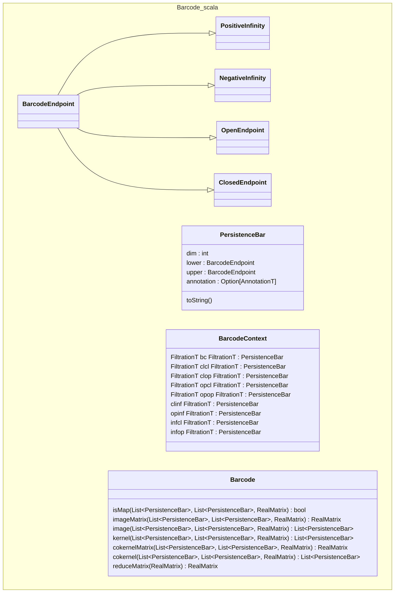

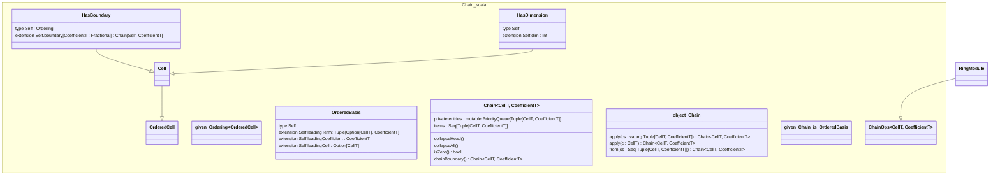

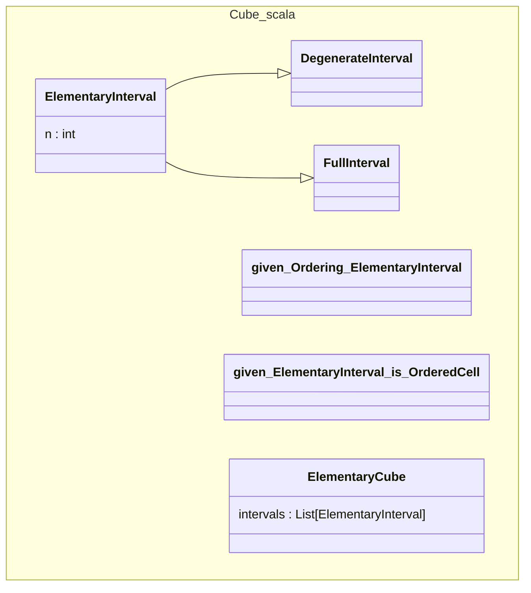

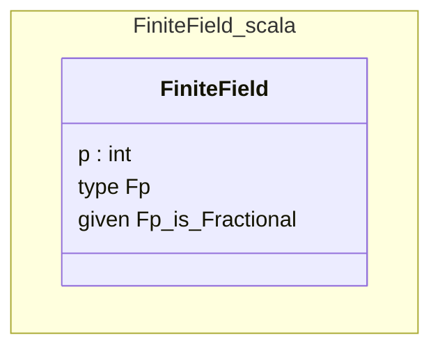

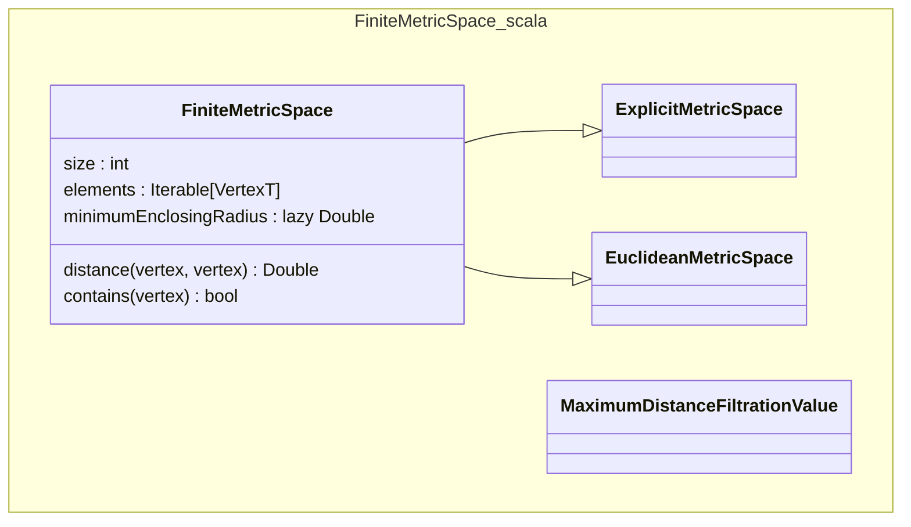

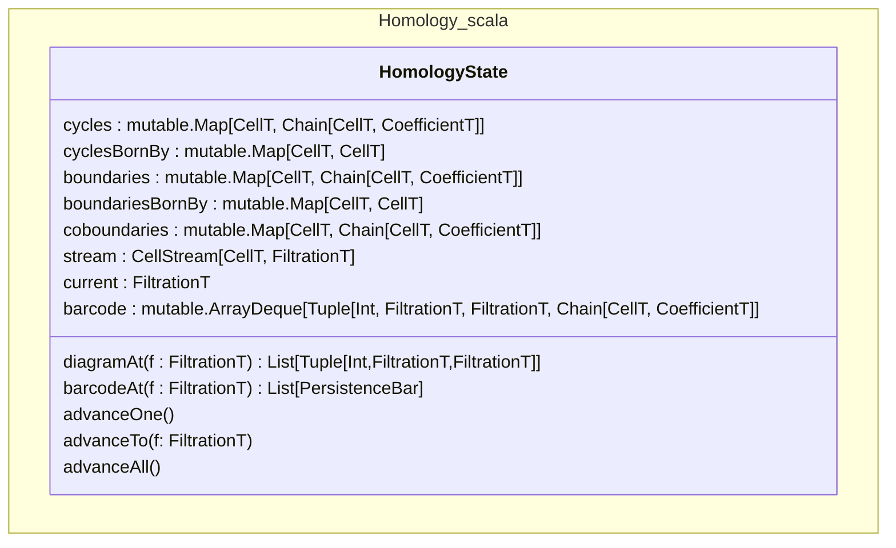

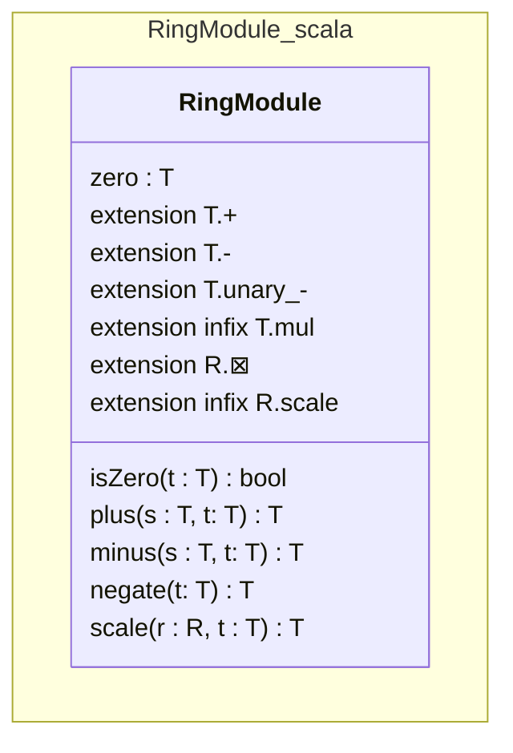

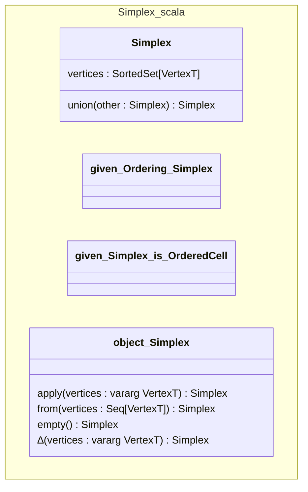

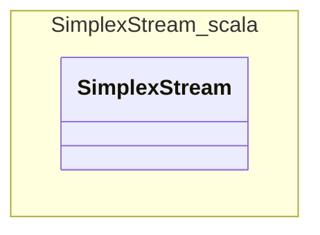

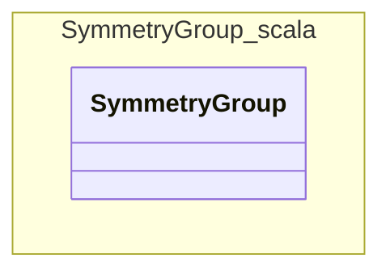

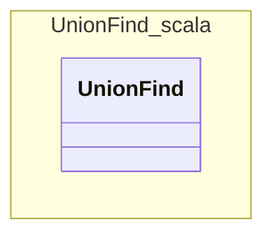

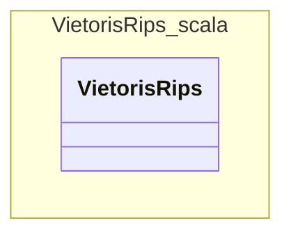